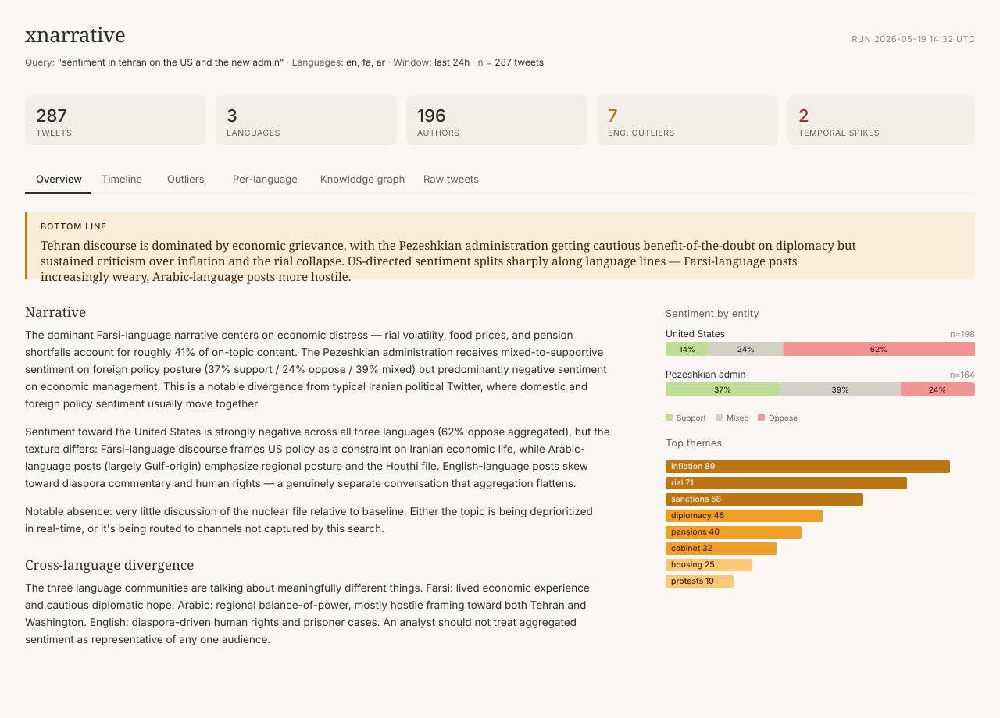

# xnarrative

A local intelligence-analyst tool for narrative monitoring on X (Twitter). Scrapes a
multilingual search, runs a Claude-driven analysis pipeline, and produces a synthesized
assessment with engagement / sentiment / temporal outliers, posting-cadence detection,
and a knowledge graph.

Designed for OSINT / supply chain / geopolitical analysts who want to quickly assess
the discourse on the ground in a specific geography or around a specific topic, across
language communities.



## What it does

Given a natural-language query like *"sentiment in Tehran on the US and the new administration"*
and a list of languages, the pipeline will:

1. **Localize the query** into idiomatic X search syntax for each language (Farsi, Arabic, English…)
2. **Scrape** the matching tweets across all languages
3. **Translate** non-English tweets to English with tone preservation
4. **Embed and cluster** to identify the dominant narrative threads
5. **Classify each tweet** for stance (support/oppose/mixed) toward each target entity, sentiment intensity, themes, and rhetorical mode
6. **Detect three classes of outliers:**
   - Engagement outliers (disproportionate reach given follower count)
   - Sentiment outliers (cut against the dominant narrative)
   - Temporal spikes (sudden volume bursts with LLM-generated summaries)
7. **Detect coordinated posting cadence** (corpus autocorrelation + per-author posting regularity)
8. **Synthesize a bottom-line assessment** with cross-language divergence analysis
9. **Extract a knowledge graph** of entities and relationships with tweet-level evidence
10. **Render everything** in a local Streamlit dashboard

---

## Quick start — getting it running for the first time

### 1. Get your API keys (5 min)

**Anthropic API key.** Go to [console.anthropic.com](https://console.anthropic.com), create
an account, then go to Settings → API Keys → Create Key. Add at least $20 in credits
(Settings → Billing) — that covers many runs. Copy the key, it starts with `sk-ant-`.

**Voyage AI key.** Go to [dash.voyageai.com](https://dash.voyageai.com), sign up, generate
a key. Voyage gives you 200M free tokens, which is essentially unlimited for this use
case — you won't pay them anything for a long time. Key starts with `pa-`.

### 2. Create a burner X account (15–30 min, the annoying part)

This is the most friction-heavy step and the one where things go sideways. **Use a
burner account, never your real identity-attached one.** X aggressively rate-limits or
suspends accounts that hit unofficial endpoints.

The goal is "boring lurker account" — brand-new accounts with zero activity get flagged
within minutes of scraping. To reduce friction:

1. **Get a phone number** that isn't your main one. Google Voice works in the US;
   otherwise a prepaid SIM. Some SMS-activation services work but X catches many of
   them — Google Voice is more reliable.
2. **Make a throwaway email** at proton.me or fastmail.
3. **Sign up at x.com** in a regular browser (not VPN, not Tor — X flags those instantly).
   Use a plausible name and date of birth. Verify the phone.
4. **Don't immediately scrape.** Spend 10–15 min acting human: follow 20–30 accounts
   in topics you'd plausibly care about, like a few tweets, scroll the feed. This ages
   the account.
5. **Leave it alone for a few hours**, ideally overnight. Accounts going from "just
   signed up" to "running 50 search calls in 10 minutes" get flagged hard.

Realistic expectation: even with all this, the account may still get CAPTCHA'd or
shadow-limited at some point. That's just how this works. If it happens, log into
x.com manually in a real browser from the same IP, clear the CAPTCHA, and retry. If
the account gets fully suspended, make another one.

### 3. Install Python and the project (5 min)

Requires Python 3.10+. Check with `python --version`.

```bash
git clone https://github.com/YOUR_USERNAME/xnarrative.git
cd xnarrative
python -m venv .venv
source .venv/bin/activate     # macOS/Linux
# .venv\Scripts\activate      # Windows PowerShell

pip install -r requirements.txt
```

If **hdbscan fails to install** (it sometimes does on Apple Silicon Macs):

```bash
pip install --upgrade pip setuptools wheel
pip install numpy cython
pip install hdbscan --no-build-isolation
```

### 4. Wire up your credentials (2 min)

```bash
cp .env.example .env
```

Open `.env` and fill in your four credentials:

```
ANTHROPIC_API_KEY=sk-ant-...your-key-here...
VOYAGE_API_KEY=pa-...your-key-here...

X_USERNAME=your_burner_handle_no_at_sign
X_EMAIL=your_burner_email@protonmail.com
X_PASSWORD=your_burner_password
```

`X_USERNAME` is the handle **without** the `@`.

### 5. Run the pipeline

Start with a single-language query to validate the setup:

```bash
python analyze.py "sentiment in tehran on the US and the new admin" \
    --languages en \
    --hours 24
```

You'll see something like:

```
→ localize: generating per-language X queries...
  → entities: ['United States', 'Pezeshkian administration']
→ scrape: querying X...
  → query: 'tehran (US OR America) lang:en since:2026-05-18' (lang=en, limit=100)
  ✓ got 78 tweets
✓ Total deduped: 78 tweets across 1 languages
→ translate: ...
→ embed: ...
→ cluster: found 4 clusters, 12 noise points (15.4%)
→ per_tweet: stance + sentiment + themes per tweet...
→ outliers: engagement, sentiment, temporal...
→ temporal: binning, spikes, cadence...
→ narrative: synthesizing assessment (Opus)...
→ knowledge_graph: extracting entities and relations...

✓ Pipeline complete. Run `streamlit run render.py` to view results.
```

The full pipeline takes **3–7 minutes** depending on tweet count. Most of that is
the per-tweet analysis stage running sequential batched Claude calls.

### 6. View results

```bash
streamlit run render.py
```

Opens a browser tab at `http://localhost:8501` with the dashboard.

### 7. Once English works, try multilingual

```bash
python analyze.py "same query" --languages en,fa,ar --hours 24 --force-stage scrape
```

`--force-stage scrape` invalidates the scrape cache and re-runs everything from there,
which pulls in the additional languages.

---

## Costs

**Per fresh run, ~250 tweets across 3 languages:**

| Stage | Model | Approx. cost |
|---|---|---|
| Query localization | Haiku | $0.002 |
| Translation | Sonnet | $0.10 |
| Per-tweet analysis | Sonnet | $0.25 |
| Spike summaries | Sonnet | $0.02 |
| Narrative synthesis | Opus | $0.20 |
| KG extraction | Sonnet | $0.05 |
| Voyage embeddings | voyage-3 | ~$0.005 (free tier covers it) |
| **Total** | | **~$0.60–0.80 per fresh run** |

500 tweets scales roughly linearly to ~$1.20–1.50.

**Iteration is essentially free** thanks to per-stage caching. If you want to tweak
the narrative-synthesis prompt and re-run just that stage:

```bash
python analyze.py "same query" --languages en,fa,ar --force-stage narrative
```

That's about $0.20 and 20 seconds, because translation, embedding, and per-tweet
analysis all load from cache.

---

## Pipeline stages

The pipeline runs in order. Each stage caches to `cache/` so you can iterate on later
stages without re-running earlier ones.

```
scrape → localize → translate → embed → cluster → per_tweet
       → outliers → temporal → spike_summary → narrative → knowledge_graph
```

Use `--force-stage <name>` to invalidate the cache from that stage forward:

```bash
# Re-run from narrative onward (cheap — iterate on prompts.py)
python analyze.py "..." --force-stage narrative

# Re-run from translation onward (medium — if you changed the translation prompt)
python analyze.py "..." --force-stage translate
```

## Offline mode

If X scraping breaks or you have a fixture file:

```bash
python analyze.py "your query" --languages en --source path/to/tweets.jsonl
```

JSONL schema (one tweet per line):

```json
{"id": "123", "text": "...", "lang": "en", "created_at": "2026-05-18T12:00:00Z",
 "like_count": 50, "retweet_count": 5, "reply_count": 2, "quote_count": 1,
 "author_id": "handle", "author_name": "Name", "author_followers": 1200,
 "author_following": 300, "author_verified": false,
 "raw_url": "https://x.com/handle/status/123"}
```

---

## Common issues

**`twitter-api-client failed: login required` or CAPTCHA errors.** Your burner account
got flagged. Open x.com in a regular browser, log in manually, complete any CAPTCHA,
then retry. If fully suspended, make a new burner.

**No tweets scraped.** Either your search query returned nothing (test the same query
on x.com directly), or the scraper is silently failing on a specific language. Try
`--languages en` first to isolate.

**hdbscan install fails.** Run the three-step install in step 3 above.

**JSON parse errors during analysis.** Claude occasionally returns malformed JSON on
long batches. The retry logic in `llm.py` handles most cases — if a stage fails entirely,
just rerun: the cache means you only redo the failed stage.

**twitter-api-client breaks after an X update.** X periodically changes their unofficial
endpoints. Check the library's [issue tracker](https://github.com/trevorhobenshield/twitter-api-client/issues).
Alternatives in the same niche: [twscrape](https://github.com/vladkens/twscrape),
[tweety-ns](https://github.com/mahrtayyab/tweety), or Playwright directly against x.com.

---

## Project structure

```
xnarrative/
├── analyze.py          # main pipeline orchestrator with stage caching
├── scrape.py           # twitter-api-client wrapper, includes offline JSONL mode
├── prompts.py          # all Claude prompts as constants — iterate here
├── llm.py              # Claude API wrapper with retries and JSON parsing
├── embed_cluster.py    # Voyage embeddings + HDBSCAN clustering
├── outliers.py         # engagement / sentiment / temporal outlier detection (no LLM)
├── render.py           # Streamlit UI
├── config.py           # tunable constants
├── requirements.txt
├── .env.example
└── cache/              # per-stage pickled outputs (gitignored)
```

**Design principle:** deterministic operations (z-scores, spike detection, clustering,
binning) live in their own modules and never call an LLM. Claude only handles tasks that
genuinely need language understanding (translation, stance classification, synthesis,
KG extraction). This keeps costs predictable and makes failures debuggable.

---

## Architecture notes

- **Scraping** uses [twitter-api-client](https://github.com/trevorhobenshield/twitter-api-client),
  which automates an authenticated X session. Verify the library is current when you clone;
  X breakage is real and ongoing.
- **Embeddings** use Voyage AI's `voyage-3` (multilingual), which handles Farsi/Arabic
  better than OpenAI embeddings.
- **Clustering** uses HDBSCAN on L2-normalized embeddings (cosine-like behavior via
  euclidean metric).
- **Outlier detection** is fully deterministic:
  - Engagement: log-transformed `engagement_per_follower` z-score
  - Sentiment: `cosine_distance_from_dominant_centroid × |sentiment_delta_from_mean|`
  - Temporal: modified z-score on MAD against a rolling-median baseline
- **Coordinated amplification detection** uses corpus-wide volume autocorrelation
  (looking for suspicious periodic peaks) and per-author posting-interval coefficient
  of variation (low CV = suspiciously regular = potentially automated).

---

## Limitations

- **Sample sizes can be small** for narrow queries × less-spoken languages. Sentiment
  bars include the n so you can see this; treat low-n bars as noise rather than signal.
- **Translation flattens nuance** especially on sarcasm-heavy political content. The
  pipeline tries to preserve register but you should spot-check the translated text in
  the Raw tweets tab.
- **Knowledge graph extraction is imperfect** — entity deduplication ("Trump" vs
  "Donald Trump" vs "the US president") is a hard problem and the LLM sometimes splits
  what should be one node. Iterate on the prompts in `prompts.py`.
- **The scraper is fragile**, not the library's fault — X actively fights unofficial
  access. Treat the scraper as the most likely failure point and the analysis pipeline
  as solid.

---

## License

MIT. Use responsibly.
